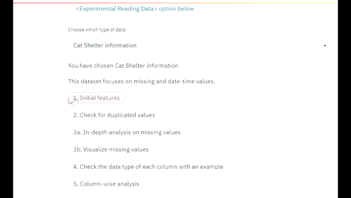
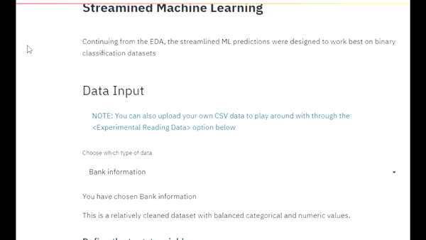

# Streamlined Exploatory Data Analysis and Machine Learning
##### (This is the project and the link is found [here](https://webapp-streamlined.herokuapp.com/) )
##### (For the UI that talks about the product, do visit [the platfrom](https://shawnd29.github.io/RapidInsights/))

This project is used to streamline the common steps used when looking at columns for data analysis. 

There are 2 platforms within this app:
1. A step-by-step EDA that highlights the numerical and categorical data used for feature analysis
2. A streamlined ML platform that provides a baseline model for analysis as a citizen data scientist
 
 Let’s look at what each of them can do:

|EDA                          |ML                        
|----------------|-----------------------------
Granular understanding of individual features|Rapid data preprocessing           
|In-depth insights on duplicated values | 11 different supervised classification models to evaluate the best metrics
|Visual analysis on missing values | 10 Folds Cross Validation to find the best hyperparameters
|Uni, bi and multivariate analysis of features         | 15 visual insights to understand the classification       
|Precise breakdown on numeric, categorical and date-time features | Deploy a pipeline of the data preprocessing and model
| | 

Special thanks to [Streamlit](https://github.com/streamlit/streamlit), [Pycaret](https://github.com/pycaret/pycaret) and [GitHub Pages themes](https://github.com/pages-themes/midnight) for their open-source platforms 

### Requirements:
Streamlit  
Pycaret
 
 
To run the platfrom locally, download the repository locally and type:
#### streamlit run app.py
 
 
To view the final product, do visit https://webapp-streamlined.herokuapp.com/
 
